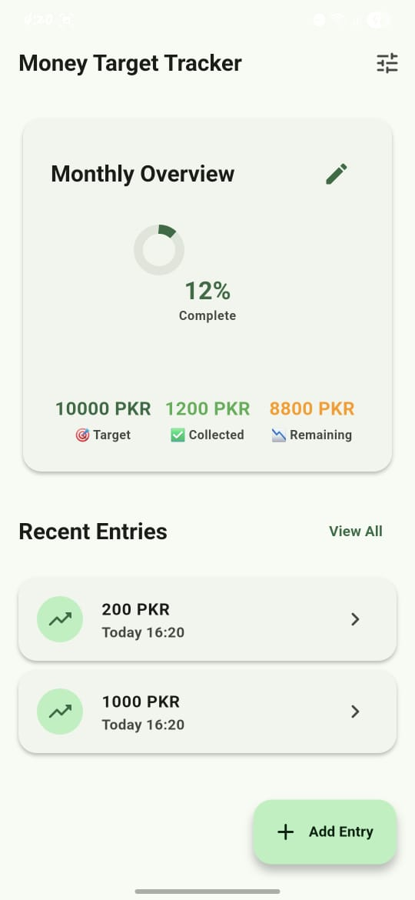
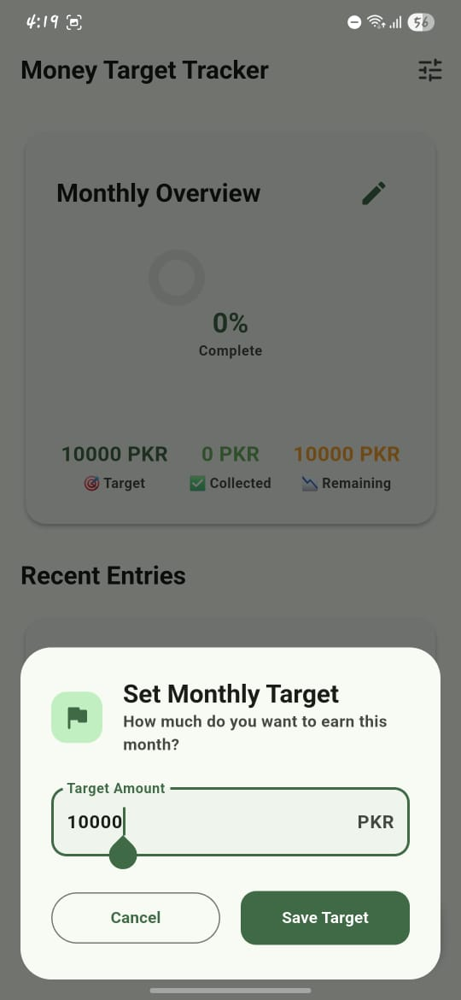
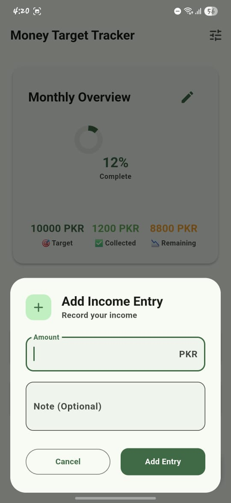
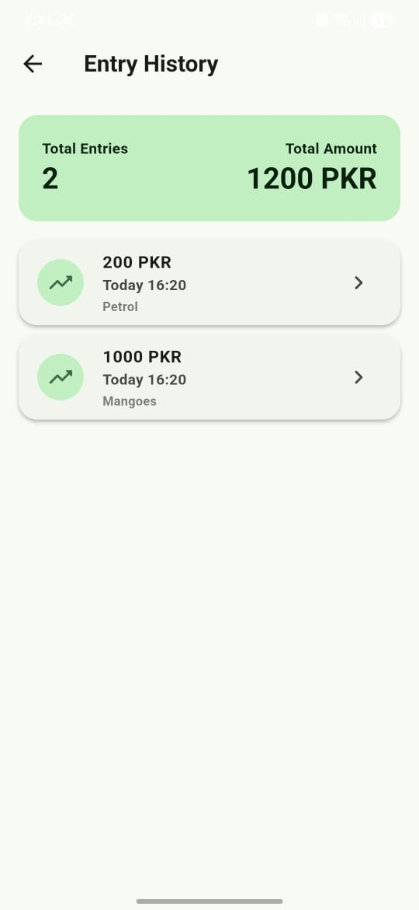

# 💰 Money Target Tracker App

A simple, modern Flutter app that helps users set a monthly income goal and track their progress by adding small income entries. The app calculates and displays how much is collected and how much remains toward the target.

---

## ✨ Features

- 🎯 Set or update monthly income target
- ➕ Add income entries with timestamps
- 📉 Live calculation of target - collected = remaining
- 📋 History list of all entries (with date & time)
- 📱 Modern UI with bottom sheets for a smooth UX
- 📊 Dashboard with progress indicator
- 🧾 Edit or delete any income entry

---

## 📸 Screenshots

<p float="left">
  
  
  
  
</p>

---

## 🛠️ Tech Stack

- **Flutter** (Latest stable version)
- **Dart**
- **Material 3**
- **SharedPreferences**

---

## 🏁 Getting Started

### 1. Prerequisites

- Flutter SDK installed
- Android Studio or VS Code
- Device/emulator setup

### 2. Clone the Repo

```bash
git clone https://github.com/MuhammadDanyalRehmanOfficial/MoneyTargetTracker.git
cd money-target-tracker
```

### 3. Run the App

```bash
flutter pub get
flutter run
```

---

## 📁 Project Structure

```
money-target-tracker/
├── lib/
│   ├── models/
│   ├── screens/
│   ├── services/
│   ├── utils/
│   ├── widgets/
│   └── main.dart
├── screenshot/
│   ├── home.jpg
│   ├── set_target.jpg
│   ├── add_entry.jpg
│   └── history.jpg
├── pubspec.yaml
└── README.md
```

---

## 🧪 Test Project Goal

> Build a working Android app with a beautiful UI and clean UX focused on helping users track earnings toward a monthly target using Flutter.

---

## 🔓 License

MIT License. Feel free to fork and improve the app!

---

## 🙌 Contributions

PRs welcome! Open issues, suggest features, or fix bugs — let’s build this together.
